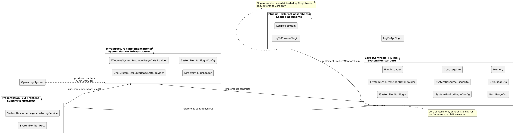

# System Performance Monitoring Application

A **cross-platform console application** that collects system resource usage (CPU, RAM, Disk) and logs the data using dynamically loaded plugins.  
The application is **extensible**, **modular**, and designed for **maintainability** and **testability**.  

---

## Features
- Collects system performance statistics at fixed configurable intervals
- Supports plugins
- Plugins can be dynamically loaded without modifying the core logic
- Cross-platform support (Windows, Linux, macOS)
- Support Configuration via `appsettings.json` and CLI arguments (with CLI taking precedence)  

## Architectural and Design Decisions

### SOLID Principles
- SOLID principles ensure that an application is modular, testable, and easy to maintain
- I have utilised SOLID principles when designing the SystemMonitor app to ensure that it is easy to maintain, test, and extend.

### Clean Architecture
SystemMonitor's implementation is separated into the following layers:
- **Core**: Contracts and DTOs, independent of frameworks.
- **Infrastructure**: Concrete implementations like plugin loader and config.
- **Presentation (CLI)**: Runs the service loop, wires everything with DI.
- **Plugins**: External modules implementing Core contracts, loaded dynamically.

Although this project could have been implemented as a single project, I chose a **Clean Architecture** approach to make the system more scalable and adaptable.  
This separation ensures that future extensions—such as adding new frontends (e.g., a GUI), alternative plugin loaders, or additional infrastructure components—can be introduced without impacting the core logic.  



### Strategy Pattern 
- SystemMonitor requires operating system specific code to retrieve system usage data
- Instead of hardcoding logic for each platform, I decided to use strategy so that it allows easily adding or swapping the logic for retrieving system usage data for specific platforms

### Producer–Consumer Pattern
- Instead of relying on a simple loop, the application uses the **Producer–Consumer pattern** to generate and process system resource usage data.
- The **producer** continuously collects data at fixed intervals, while **consumers (plugins)** process it independently.
- This ensures that data collection is **not delayed by slower plugins** — the producer keeps running at its own pace, and plugins can consume the data whenever they are ready.  

### Plugin Architecture
- SystemMonitor has plugin support
- Users can develop plugins of their own to log/send system resource usage data to files, API's, etc
- The plugins are loaded from the configured directory
- Adding new plugins does not require code changes to app

## Limitations of Current Code
- **Manual plugin deployment**: Users must manually copy plugins into the configured directory.
- **Limited plugin initialization**: Plugins with constructors requiring arguments may fail to initialize properly.
- **Custom message broadcasting**: The current setup may be reinventing message broadcasting between producer and consumers; using TPL Dataflow or a similar mechanism could be a better alternative.
- **Restricted CLI configuration**: Only a subset of properties can currently be set via CLI arguments; more robust argument handling is needed.  

## How to Run
1. Download the application from [here](https://github.com/Yogesh9000/SystemMonitor/raw/refs/heads/master/SystemMonitor.CliApp/SystemMonitor.zip)
2. Open the folder in terminal and run following command: `.\SystemMonitor.CliApp.exe Delay=2000`
   - `SystemMonitor.CliApp.exe`: is the application
   - `Delay=2000`: is the delay in ms at which application will execute
3. To execute a specific plugin run following command: `.\SystemMonitor.CliApp.exe Delay=2000 EnablePlugin=<Plugin Name>`
   - SystemMonitor comes with 3 default plugins:
     - LogToConsole
     - LogToFile
     - LogToApi
   - `<Plugin Name>`: name of the plugin to execute. can be one of the 3 default plugins or a user defined plugin
   - Plugins can also be enabled or disabled from appsettin.json by modifying value of key `Plugins:Enabled`:
      ```json
        {
          "Plugins" : {
            "Enabled" : [
              "LogToConsole",
              "LogToFile",
              "LogToApi"
            ],
          },
        }
       ```
   - Multiple plugins can be enabled simultaneously

## How to Compile
> [!NOTE]
> Users will need `dotnet 9` insatlled on thier machine
1. After cloning the repo open it in a terminal
2. Cd into directory `SystemMonitor.CliApp`
3. Run command to execute application: `dotnet run`. User can pass optionally pass arguments like so: `dotnet run -- <args>..`
4. Users can add more plugins by copying them to folder `SystemMonitor.CliApp/Plugins`(This folder gets copied to bin directory)
5. Users can configure plugin using `SystemMonitor.CliApp/appsettings.json`, if the plugin supports it.

## Configure Plugins
### LogToFile
- Plugin **LogToFile** supports configuring the log file path:
- Users can set it in `appsettings.json` like so:
  ```json
    {
      "LogToFile" : {
        "FilePath" : "log.txt"
      },
    }
   ```
  
## LogToApi
- Plugin **LogToApi** supports configuring the api endpoint:
- Users can set it in `appsettings.json` like so:
  ```json
    {
      "LogToApi" : {
        "EndPoint" : "http://localhost:5222/usage"
      },
    }
   ```
